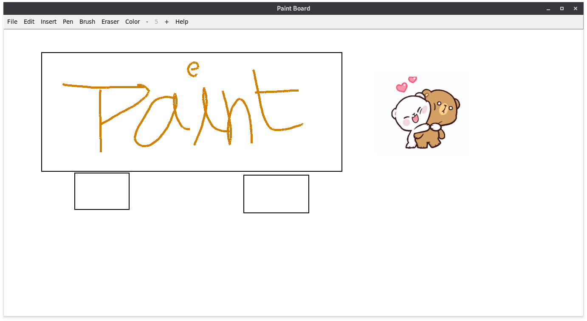

# ReviewScrapper

Paint application using tkinter in Python 3 with lot of options.
    Available options
                1. Tools
                    * Pen
                        - Custom Size
                        - Custom Color
                    * Brush
                        - Custom Size
                        - Custom Color
                    * Shapes
                        - Rectange
                        - Circle
                        - Oval
                        - line
                2. Image
                    * You can add image to Paint.
                    * You can open image to Paint.
                    * You can Save image to desired location.
                    

  

# Requirements

    
    - Modules specified in requirements.txt

    

# Usage

    
    * git clone https://github.com/swaroopmaddu/Paint-Tkinter.git pyscrapper

    * virtualenv -p python3 Paint-Tkinter/
    
    * cd Paint-Tkinter/

    * source bin/activate

    * pip install -r requirements.txt 

    * python main.py

    * Enjoy
